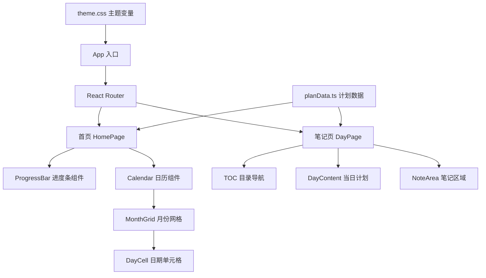

## 产品概述

一个基于两个月复习计划文档（3月1日 - 5月10日，共71天）的静态复习网站，以日历视图直观展示每日复习安排，帮助用户跟踪复习进度并记录学习笔记。

## 核心功能

### 首页 - 日历视图与进度追踪

- 以月视图形式展示3月、4月、5月三个月的日历，每天显示当日复习主题摘要
- 不同学习阶段用不同颜色标记区分（项目准备、模拟面试、JavaSE、JVM、JUC、Spring、MQ/网络/Netty、微服务/分布式、系统设计，共9个阶段）
- 页面顶部展示时间进度条，标示当前日期在整个71天复习周期中的位置百分比
- 日历中每天可点击，通过路由跳转至对应的每日笔记页面

### 每日笔记页面（71个页面）

- 路由格式为 `/day/YYYY-MM-DD`
- 每个页面预填充当天的复习计划内容（从文档中提取的上午/下午/晚上任务安排与输出物）
- 页面包含目录导航（TOC），便于快速定位各段落
- 预留笔记编辑区域，便于后续手动补充学习笔记

### 全局设计

- 纯色简洁主题，干净配色，无花哨装饰
- 响应式布局，适配桌面端浏览

## 技术栈

- **前端框架**: React 18 + TypeScript
- **构建工具**: Vite
- **路由**: React Router v6
- **样式方案**: CSS Modules（纯色简洁风格，不引入 Tailwind 以保持轻量）
- **部署**: GitHub Pages（纯静态站点，使用 `gh-pages` 包一键部署）

## 实现方案

### 整体策略

采用 React SPA 架构，将71天的复习计划数据从 Markdown 文档中提取并结构化为 TypeScript 数据文件，首页通过日历组件渲染，点击日期通过 React Router 跳转至对应笔记页面。每日笔记页面的内容由数据驱动渲染，同时预留空白笔记区域。

### 关键技术决策

1. **数据存储方式**: 将复习计划解析为结构化 TypeScript 数据文件（`planData.ts`），而非运行时解析 Markdown。每天包含日期、阶段标签、颜色标识、上午/下午/晚上任务描述、输出物等字段。这样可以实现类型安全和更好的渲染控制。
2. **日历组件**: 自研轻量日历组件，不引入第三方日历库。按月份分块展示，每个月份一个网格，支持阶段颜色标记。71天跨3个月份（3月、4月、5月前10天），复杂度可控。
3. **笔记页面**: 71个页面不需要71个独立文件。采用动态路由 `/day/:date` + 数据驱动渲染的方式，由同一个 `DayPage` 组件根据 URL 参数查询对应数据渲染。同时为每天创建独立的笔记 Markdown 文件（`notes/YYYY-MM-DD.md`），便于后续补充内容。
4. **路由方案**: 使用 `HashRouter` 替代 `BrowserRouter`，因为 GitHub Pages 不支持 SPA 的 history 模式路由回退。Hash 路由格式如 `/#/day/2026-03-01`。
5. **GitHub Pages 部署**: Vite 配置 `base` 为仓库名（如 `/summer/`），`package.json` 添加 `deploy` 脚本使用 `gh-pages` 包将 `dist` 目录发布到 `gh-pages` 分支。
6. **目录导航（TOC）**: 笔记页面根据内容结构自动生成目录，包含"今日计划"、"上午"、"下午"、"晚上"、"输出物"、"学习笔记"等固定锚点。
7. **进度条**: 基于当前日期（2026-03-04）与计划起止日期（3/1-5/10）的差值计算百分比，使用 CSS 渐变实现视觉效果。

### 性能考量

- 71天数据量极小（约10KB），无需懒加载或分页
- 笔记文件按路由懒加载即可
- 整站为纯静态资源，无 API 请求开销

## 实现备注

- 日历网格需正确处理每月起始星期的偏移（如3月1日是星期日）
- 进度条需根据当前真实日期动态计算，计划外的日期（非3/1-5/10范围）显示0%或100%
- 阶段颜色映射需覆盖全部13个阶段，使用语义化的颜色变量统一管理
- 笔记页面需处理无效日期的404路由

## 架构设计

### 系统架构



### 数据流

用户访问首页 -> 加载 planData -> 渲染日历 + 进度条 -> 点击日期 -> Router 跳转 `/day/2026-03-01` -> DayPage 从 planData 查询当日数据 -> 渲染计划内容 + TOC + 笔记区

### 阶段颜色映射（13个阶段）

| 阶段 | 日期范围 | 颜色语义 |
| --- | --- | --- |
| 项目准备与整合 | 3/1-3/14 | 蓝色 |
| 第一次模拟面试 | 3/15-3/16 | 红色 |
| Java SE | 3/17-3/23 | 绿色 |
| JVM | 3/24-3/30 | 紫色 |
| JUC | 3/31-4/6 | 橙色 |
| 第二次模拟面试 | 4/7-4/8 | 红色 |
| Spring | 4/9-4/15 | 青色 |
| MQ/网络/Netty | 4/16-4/22 | 黄色 |
| 微服务/分布式 | 4/23-4/29 | 靛蓝 |
| 第三次模拟面试 | 4/30-5/1 | 红色 |
| 系统设计 | 5/2-5/8 | 棕色 |
| 第四次模拟面试 | 5/9-5/10 | 红色 |


## 目录结构

```
d:/Agent/summer/
├── docs/                          # [EXISTING] 原始复习计划文档
│   ├── 三月计划.md
│   └── 四月计划.md
├── index.html                     # [NEW] Vite 入口 HTML 文件，挂载 React 根节点
├── package.json                   # [NEW] 项目依赖配置，包含 react/react-dom/react-router-dom/vite/typescript 等
├── tsconfig.json                  # [NEW] TypeScript 编译配置
├── vite.config.ts                 # [NEW] Vite 构建配置，配置路径别名和开发服务器
├── src/
│   ├── main.tsx                   # [NEW] React 应用入口，渲染 App 组件到 DOM
│   ├── App.tsx                    # [NEW] 根组件，配置 BrowserRouter 路由（/ 首页、/day/:date 笔记页），包含全局 Layout
│   ├── vite-env.d.ts              # [NEW] Vite 环境类型声明
│   ├── styles/
│   │   ├── global.css             # [NEW] 全局样式重置与 CSS 变量定义（13个阶段颜色、字体、间距、进度条样式等主题变量）
│   │   └── components/
│   │       ├── HomePage.module.css    # [NEW] 首页布局样式：页面标题、进度条容器、日历网格区域的排版
│   │       ├── Calendar.module.css    # [NEW] 日历组件样式：月份网格、星期标头、日期单元格、阶段颜色标记、hover 与选中态
│   │       ├── ProgressBar.module.css # [NEW] 进度条样式：条形容器、已完成区域渐变填充、百分比文字、日期标注
│   │       ├── DayPage.module.css     # [NEW] 笔记页布局：左侧 TOC 导航固定定位、右侧内容区、任务卡片、笔记编辑区域
│   │       └── Legend.module.css      # [NEW] 图例组件样式：阶段颜色圆点与标签的横排布局
│   ├── data/
│   │   ├── planData.ts            # [NEW] 核心数据文件。定义 DayPlan 接口（date/phase/phaseLabel/morning/afternoon/evening/output 字段），导出71天完整计划数据数组，从两份 Markdown 文档手动提取并结构化。同时导出阶段枚举与颜色映射表。
│   │   └── phases.ts              # [NEW] 阶段常量定义。定义 Phase 枚举（PROJECT_PREP/MOCK_INTERVIEW_1/JAVA_SE/JVM/JUC 等13个值）、阶段中文标签映射、阶段颜色映射、日期范围判断工具函数 getPhaseByDate()。
│   ├── pages/
│   │   ├── HomePage.tsx           # [NEW] 首页组件。顶部显示标题与副标题，下方渲染 ProgressBar 进度条组件，再下方渲染3个月份的 Calendar 日历网格，底部显示 Legend 阶段图例。
│   │   └── DayPage.tsx            # [NEW] 笔记页组件。通过 useParams 获取 date 参数，从 planData 查询当日计划。左侧固定渲染 TOC 目录导航（锚点跳转），右侧依次渲染：日期标题+阶段标签、上午/下午/晚上三个任务卡片、输出物区域、笔记内容区（预留空白带提示文字）。无效日期显示404提示。含返回首页链接。
│   ├── components/
│   │   ├── Calendar.tsx           # [NEW] 日历组件。接收 year/month 参数，渲染7列网格（周一至周日），每个日期单元格显示日期数字+阶段色块+当日主题缩略文字。仅高亮3/1-5/10范围内的日期，其余灰显。点击触发 navigate 跳转。
│   │   ├── MonthGrid.tsx          # [NEW] 单月网格组件。计算当月天数和起始偏移，渲染星期标头行和日期单元格行。复用 DayCell 组件。
│   │   ├── DayCell.tsx            # [NEW] 日期单元格组件。显示日期数字，根据 phase 设置背景色，显示当天主题的简短标签（不超过6个字），当天日期特殊标记（边框高亮），点击跳转对应路由。
│   │   ├── ProgressBar.tsx        # [NEW] 进度条组件。计算当前日期距3/1的天数占71天总数的百分比，渲染水平进度条（填充色+背景色），显示百分比数字与"第X天/共71天"文案，标注起止日期。
│   │   ├── TOC.tsx                # [NEW] 目录导航组件。接收标题锚点列表，渲染固定在左侧的垂直导航，点击平滑滚动到对应锚点。高亮当前可视区域的锚点。
│   │   └── Legend.tsx             # [NEW] 图例组件。横排展示所有阶段的颜色圆点+中文标签，帮助用户理解日历中的颜色含义。
│   └── utils/
│       └── dateUtils.ts           # [NEW] 日期工具函数。包含：formatDate（格式化）、getDaysInMonth（获取月天数）、getFirstDayOfMonth（获取月首日星期）、calculateProgress（计算进度百分比）、isInPlanRange（判断是否在计划范围内）、parseDate（字符串转Date）。
├── notes/                         # [NEW] 71个每日笔记 Markdown 文件目录，每个文件以日期命名
│   ├── 2026-03-01.md              # [NEW] 3月1日笔记文件，预填充当日主题标题，留空供后续补充
│   ├── 2026-03-02.md              # [NEW] ...（以此类推共71个文件）
│   ├── ...
│   └── 2026-05-10.md              # [NEW] 5月10日笔记文件
└── README.md                      # [MODIFY] 更新为项目说明文档，介绍网站功能、启动方式和使用说明
```

## 关键代码结构

```typescript
// src/data/planData.ts - 核心数据接口
export interface DayPlan {
  date: string;           // "2026-03-01"
  phase: Phase;           // 阶段枚举
  title: string;          // "统一目标与架构边界"
  morning: string;        // 上午任务描述
  afternoon: string;      // 下午任务描述
  evening: string;        // 晚上任务描述
  output: string;         // 输出物
}

export interface PhaseConfig {
  label: string;          // "项目准备与整合"
  color: string;          // "#3B82F6"
  startDate: string;      // "2026-03-01"
  endDate: string;        // "2026-03-14"
}
```

## 设计风格

采用纯色简洁主题，以功能优先的极简设计呈现复习计划。界面干净明亮，无渐变、无花哨装饰，通过阶段颜色色块为日历注入视觉层次。整体风格偏向学术/工具类应用，强调信息可读性与操作效率。

## 页面设计

### 首页（HomePage）

- **顶部标题栏**: 居中展示网站标题"暑期实习复习计划"与副标题"2026.03.01 - 2026.05.10 | 71天"，使用大号粗体字，下方分割线。
- **进度条区域**: 全宽水平进度条，左侧标注起始日期"3/1"，右侧标注结束日期"5/10"，已完成部分使用主色调填充，未完成部分为浅灰色。进度条上方显示"第X天 / 共71天（XX%）"。进度条高度8px，圆角设计。
- **日历区域**: 三个月份的日历网格横向排列（大屏）或纵向堆叠（小屏）。每月网格顶部显示月份标题（如"三月"），下方为7列星期标头，再下方为日期单元格网格。有计划的日期显示阶段色块背景和简短主题文字，无计划日期灰显。当天日期用边框高亮标记。鼠标悬停显示轻微阴影提升效果。
- **图例区域**: 页面底部或日历下方，横排展示各阶段的颜色圆点与对应标签名称，便于快速识别阶段。
- 整体布局最大宽度1200px居中，留足左右边距。

### 笔记页（DayPage）

- **左侧目录导航**: 固定在左侧的垂直导航栏，宽度200px，列出"今日计划/上午/下午/晚上/输出物/学习笔记"等锚点，点击平滑滚动。当前可视区域对应的锚点高亮显示。
- **顶部信息栏**: 显示日期（如"2026年3月1日 星期日"）、阶段色块标签（如彩色圆角标签"项目准备与整合"）、返回首页的链接按钮。前后日期导航箭头。
- **任务卡片区域**: 上午/下午/晚上各一个白色卡片，左侧带阶段色竖线装饰。卡片标题为时段名称，内容为任务描述文字。
- **输出物区域**: 独立卡片列出当日预期输出物，使用列表形式。
- **笔记区域**: 底部留出大面积空白区域，带浅灰色虚线边框和提示文字"在此添加学习笔记..."，为后续内容补充预留空间。